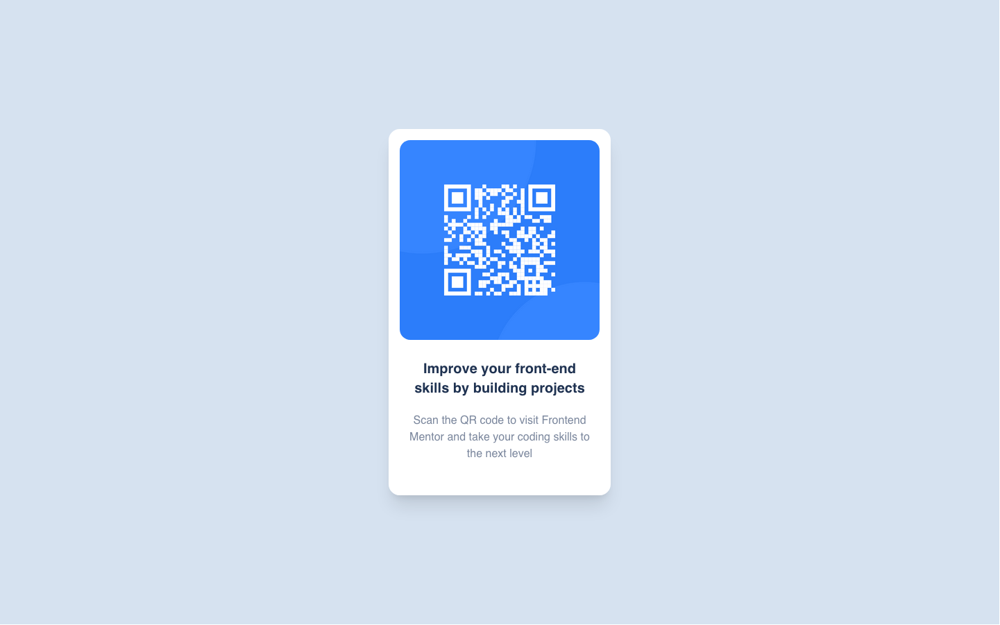

# Frontend Mentor - QR code component solution

This is a solution to the [QR code component challenge on Frontend Mentor](https://www.frontendmentor.io/challenges/qr-code-component-iux_sIO_H). 

## Table of contents

- [Overview](#overview)
  - [Screenshot](#screenshot)
  - [Links](#links)
- [My process](#my-process)
  - [Built with](#built-with)
- [More by me](#author)

**Note: Delete this note and update the table of contents based on what sections you keep.**

## Overview
Simple page and card component built with React and tailwindcss. Tailwindcss may not be the easiest styling framework to work with but it provides better results when you figure out how it works.

### Screenshot

### Links

- Solution URL: [GitHub repo](https://github.com/chukwudibarrah/qr-code-component)
- Live Site URL: [Netlify](https://react-qr-code-component.netlify.app/)

## My process

### Built with

- Mobile-first workflow
- [React](https://reactjs.org/) - JS library
- [tailwindcss](https://tailwindcss.com/) - For styles
- [Netlify](https://www.netlify.com/) - Hosting live site

## More by me

- Website - [Chukwudi Barrah](https://www.chukwudibarrah.com)
- Frontend Mentor - [@chukwudibarrah](https://www.frontendmentor.io/profile/chukwudibarrah)

